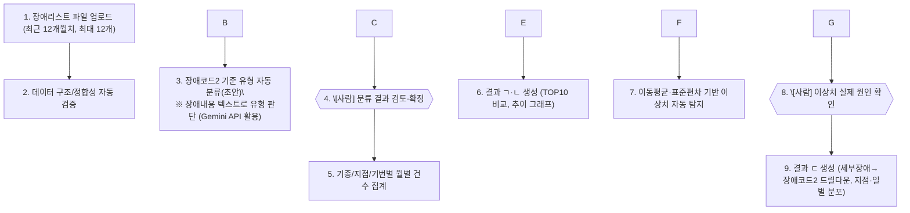
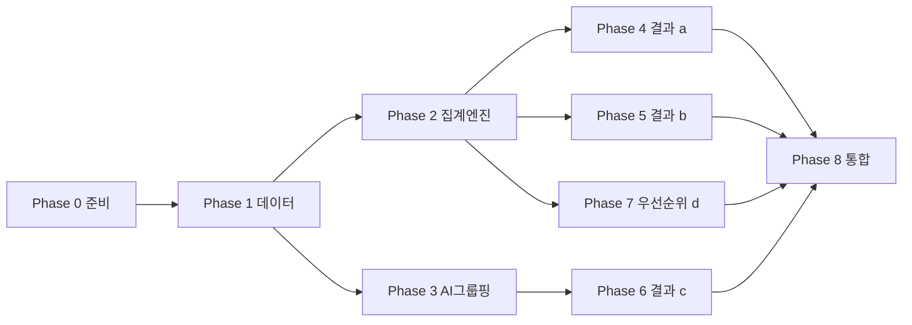

# 장애 다발 기기 분석 PoC

> **로컬 실행:** `run.bat` 또는 `python web_app.py` → http://localhost:8502  
> **스택:** Python Flask + SQLite + Plotly (+ Gemini API, 선택)  
> **GitHub·배포:** [DEPLOY.md](DEPLOY.md) 참고 (Render Blueprint 지원)

---

# 장애 다발 기기 분석 자동화 시스템 요구사항 명세서

> **로컬 실행:** 프로젝트 폴더에서 `run.bat` (또는 PowerShell: `.\run.bat`) → http://localhost:8502  
> **UI:** Python Flask (Streamlit 미사용)

## 문서 정보

|항목|내용|
|-|-|
|문서명|장애 다발 기기 분석 자동화 시스템 요구사항 명세서|
|목적|Cursor AI 기반 구현을 위한 PoC(Proof of Concept) 개발 사전 정의|
|기반 자료|`5월장애\_분석.xls` (2026년 5월, 6,806건) 및 사전 인터뷰 대화 내용|
|개발 언어|Python|
|UI 프레임워크|Streamlit|
|AI 활용|Google Gemini API|

\---

## 1\. 개요

### 1.1 배경 및 목적

현재 ATM/키오스크 등 금융 자동화기기에서 발생하는 월별 장애리스트(Excel)를 담당자가 수작업으로 확인하고 있다. 본 시스템은 이 장애리스트 파일을 업로드하면 자동으로 데이터를 집계·분석하여, 장애가 잦은 기기와 장애 패턴을 담당자가 빠르게 파악하고 관리 포인트를 발견할 수 있도록 지원하는 것을 목적으로 한다.

### 1.2 대상 업무

장애 다발 기기 분석 (월별 장애리스트 기반)

### 1.3 핵심 결과물 (3종)

|코드|결과물명|설명|
|-|-|-|
|a|전체 기기 월별 장애 비교|기종별/지점별/기번별 월별 장애건수 TOP10 비교|
|b|특정기기의 월별/년도별 장애 흐름도|특정 기기 선택 시 건수 추이를 꺾은선 그래프로 표시|
|c|특정장애코드의 장애 분석|AI유형→세부장애→장애코드2→지점→기번→일별 드릴다운 분석|
|d|관리 우선순위 추천|점검이 필요한 기기를 위험도 순으로 자동 추천|

### 1.4 비개발자를 위한 한줄 요약

> "매달 엑셀 장애 파일을 웹 화면(브라우저)에 올리기만 하면, 어떤 기기·어떤 장애가 많은지, 어디서 얼마나 자주 발생했는지를 자동으로 그래프와 표로 보여주는 도구"

\---

## 2\. 용어 정의

|용어|정의|
|-|-|
|기종|기기의 모델명 (예: ATEC-ATM(LM-20T)). 현재 3종 존재|
|기번|개별 기기의 고유 식별번호 (예: 0115A51). 특정 지점에 설치된 하나의 실물 기기를 의미|
|지점명|기기가 설치된 지점/장소명|
|점번|지점 고유 코드|
|세부장애|현재 사용 중인 장애 코드 (예: 09322, ATMS1 등 총 60여 종, 숫자형/영문형 혼재)|
|장애내용|세부장애 코드에 대한 한글 설명 텍스트|
|장애코드2 (신규, 향후 추가 예정)|세부장애와는 별도의 독립적인 코드 체계. 코드값만 존재하며 자체 설명 텍스트는 없음. 세부장애와 같은 행(row)에 함께 기록되나 사전에 정의된 매핑 테이블은 없음|
|장애 다발 기기|특정 기간 내 장애 발생 건수가 상위(TOP N)에 속하는 기기|
|드릴다운|상위 항목(세부장애)을 선택했을 때, 그 조건으로 필터링된 데이터 안에서 하위 항목(장애코드2 등)의 분포를 추가로 조회하는 방식. 사전 정의된 계층 구조가 아니라 필터링 기반으로 동작함|

\---

## 3\. 입력 데이터 명세

### 3.1 파일 형식

* 형식: Excel (`.xls` / `.xlsx`)
* 업로드 방식: 드래그 앤 드롭, **최대 12개 파일(=최근 12개월치)** 동시 업로드 가능
* 업로드 정책:
  * 월별 장애 파일을 1개월 단위로 업로드한다.
  * 업로드된 데이터는 내부 누적 DB(SQLite 등)에 저장된다.
  * 프로그램 실행 시 기존 누적 DB를 자동으로 로드한다.
  * 동일 연월의 파일을 다시 업로드하면 기존 데이터를 교체(또는 덮어쓰기)한다.
* 장애코드2 컬럼이 없는 경우는 기본 세부장애코드로 장애코드2 컬럼을 생성하며, 생성 규칙은 별도 "장애코드.xlsx" 파일의 1:1 매핑을 적용한다.

### 3.2 컬럼 정의

|컬럼명|설명|예시|데이터 타입|필수 여부|비고|
|-|-|-|-|-|-|
|점번|지점 코드|0115|문자열|필수||
|지점명|지점명|강남역금융센터|문자열|필수||
|기번|개별 기기 ID|0115A51|문자열|필수||
|기종|기기 모델명|ATEC-ATM(LM-20T)|문자열|필수|현재 3종|
|발생일자|장애 발생일|2026-05-01|날짜|필수|일 단위|
|세부장애|장애 코드(ATMS)|09322 / ATMS1|문자열|필수|숫자형+영문형 혼재, 약 60종|
|장애내용|장애 코드 설명|카드/명세표 미수취|문자열|필수|세부장애 코드의 한글 설명|
|장애코드2|세부 장애코드 (업체)|1133001234|문자열|**현재 파일에 없음, 향후 추가 예정**|세부장애와 독립적인 별도 체계, 자체 설명 텍스트 없음|

### 3.3 샘플 데이터 특성 (2026년 5월 기준, 참고용)

* 총 6,806건 (5월 1일\~27일)
* 지점 수: 431개 / 기기 수(기번 기준): 1,042대
* 기종: 3종 (ATEC-ATM(LM-20T) 6,212건, ATEC-ATM(LC-24) 399건, LG-ATM(LC-20T) 194건)
* 세부장애 코드: 60종 (상위 코드: 09322, 10514, 33072, 10518, 20524 등)

### 3.4 장애코드2 생성 규칙 (필수)

`장애코드2` 컬럼이 없는 원본 파일도 반드시 처리할 수 있어야 한다.

* `장애코드2` 컬럼이 없는 경우, 별도 관리되는 **"장애코드.xlsx"** 매핑 파일을 이용하여 `세부장애 → 장애코드2`를 **1:1 매핑 생성**한다.
* 생성된 `장애코드2`는 내부 DB에 저장되며 이후 분석에서는 원본 컬럼과 동일하게 사용한다.
* 매핑되지 않는 세부장애가 발견되면 사용자에게 목록을 표시하고, 매핑 파일을 갱신한 후 다시 생성할 수 있어야 한다.
* 따라서 모든 분석 기능(드릴다운, AI 그룹핑, 집계)은 항상 `장애코드2`를 기준으로 수행한다.

\---

## 4\. 전체 업무 흐름 (프로세스)



> 굵은 테두리(4번, 8번)는 \*\*사람의 직접 확인·판단이 반드시 필요한 단계\*\*이며, 시스템이 자동으로 건너뛸 수 없다.

\---

## 5\. 기능 요구사항 (Functional Requirements)

### FR-1. 파일 업로드 및 데이터 검증

* 사용자는 Streamlit 화면에서 최대 12개의 월별 장애리스트 파일을 드래그 앤 드롭으로 업로드할 수 있어야 한다.
* 시스템은 업로드된 각 파일의 필수 컬럼(점번, 지점명, 기번, 기종, 발생일자, 세부장애, 장애내용)이 존재하는지 자동 검증해야 한다.
* 필수 컬럼 누락, 빈 파일, 지원하지 않는 형식일 경우 명확한 오류 메시지를 화면에 표시해야 한다.
* `장애코드2` 컬럼이 없으면 `장애코드.xlsx`를 이용하여 자동 생성한 후 분석을 진행해야 한다.

* 동일 연월 데이터가 이미 존재하는 경우 사용자가 **교체 / 추가 / 취소**를 선택할 수 있어야 한다.
* 시스템은 현재 DB에 저장된 월별 데이터 목록을 조회할 수 있어야 한다.
* 사용자는 특정 월 데이터를 삭제할 수 있어야 한다.

### FR-2. 장애코드 유형 자동 그룹핑 (AI 활용, Gemini API)

* 그룹핑 기준값: `장애코드2` (컬럼이 없는 경우 `세부장애`로 대체)
* 그룹 유형명 판단 재료: 같은 행의 `장애내용` 텍스트
* 처리 방식: 고유한 (장애코드2 또는 세부장애, 장애내용) 조합 목록을 Google Gemini API에 전달하여, 카드/현금/통신/기구/기타 등 유형별 그룹핑 초안(라벨)을 생성한다.
* 결과는 표 형태(코드, 장애내용, AI 제안 유형)로 사람에게 제시되어야 한다.
* API 호출 실패 시, 키워드 기반의 간단한 규칙(예: "카드" 포함 시 "카드류") 폴백 로직으로 대체 그룹핑을 제공해야 한다.

### FR-3. 그룹핑 결과 검토·확정 화면 (사람 개입 필수)

* 사용자는 AI가 제안한 유형 그룹핑 결과를 화면에서 확인하고, 각 코드의 유형을 직접 수정할 수 있어야 한다.
* "확정" 버튼을 눌러야 다음 단계(집계, 결과물 ㄷ)에 반영되며, 확정 전에는 잠정(초안) 상태로만 사용된다.
* 확정된 그룹핑 결과는 세션 내에서 저장되어, 이후 결과물 ㄷ 화면에서 재사용된다.

### FR-4. 기종/지점/기번별 월별 집계

* 업로드된 12개월치 데이터를 기준으로 기종별, 지점별, 기번별 월별 장애 건수를 각각 집계해야 한다.
* 집계는 pandas의 `groupby` 연산을 통해 수행하며, 원본 데이터가 변경되면 재계산되어야 한다.


### 5.1 분석 화면 연계 흐름

세 가지 결과 화면은 독립 기능이면서도 다음과 같은 분석 흐름을 지원해야 한다.

1. **결과물 A**에서 장애가 많은 기기 또는 지점을 확인한다.
2. 선택한 기기를 **결과물 B**로 전달하여 월별 추이를 분석한다.
3. 특정 월 또는 특정 장애를 선택하면 **결과물 C**로 이동하여 AI 유형 → 세부장애 → 장애코드2 → 지점 → 기번 → 일별 추이 순으로 원인을 분석한다.

가능한 경우 화면 간 선택 조건은 자동으로 전달하여 사용자가 동일 조건을 다시 입력하지 않도록 한다.

### FR-5. 결과물 a — 전체 기기 월별 장애 비교

* 기종별 / 지점별 / 기번별, 3개의 독립된 화면(탭)으로 제공한다.
* 각 화면은 최근 12개월 데이터를 기준으로 선택한 월의 장애건수 상위 10개(TOP10) 항목을 막대그래프 및 표로 보여준다.
* 월 선택 드롭다운을 통해 특정 월 기준 TOP10을 조회할 수 있어야 한다.

### FR-6. 결과물 b — 특정기기의 월별 장애 흐름도

* 사용자는 '기번' 또는 '기종'을 각각 선택하여 분석할 수 있어야 한다.
* 기번 선택 시 해당 개별 기기의 월별 장애 건수 추이를 꺾은선 그래프로 표시한다.
* 기종 선택 시 해당 기종 전체의 월별 장애 건수 추이를 꺾은선 그래프로 표시한다.
* 데이터가 1개월치만 있을 경우, "추세 분석을 위해 더 많은 월별 데이터가 필요합니다" 안내 문구를 표시해야 한다.
* 그래프에는 전월 대비 증감률, 이동평균, 이상치 여부를 함께 표시해야 한다.
* 동일 기종 평균 및 전체 평균과 비교할 수 있어야 한다.

### FR-7. 이상치·급증 자동 탐지

* 이동평균(Moving Average)과 표준편차(Standard Deviation)를 기반으로 통계적 이상치를 자동 탐지한다.
* 판단 기준(기본값): 특정 월의 건수가 `이동평균 ± 2 × 표준편차` 범위를 벗어나는 경우 이상치로 표시

  * 계산에는 **최소 3개월 이상**의 데이터가 필요하며, 그 미만인 경우 이상치 탐지 기능은 비활성화하고 안내 문구를 표시한다.
* 탐지된 이상치는 목록(대상 기기/지점, 발생 월, 건수, 평소 대비 증가율)으로 화면에 제시되어야 한다.

### FR-8. 이상치 원인 확인 화면 (사람 개입 필수)

* 시스템이 탐지한 이상치 목록에 대해, 사용자가 각 항목별로 "확인 완료 / 원인 메모"를 직접 입력할 수 있는 화면을 제공해야 한다.
* 이 단계는 시스템이 자동으로 완료 처리할 수 없으며, 실제 원인 파악은 사람의 판단 영역으로 남긴다.

### FR-9. 결과물 c — 특정장애코드의 장애 분석 (드릴다운)

* 1단계: AI 유형 그룹(예: 카드류, 현금류, 통신류)을 선택한다.
* 2단계: 선택한 AI 유형에 속하는 `세부장애` 목록을 조회한다.
* 3단계: 선택한 `세부장애`에 해당하는 `장애코드2` 분포를 조회한다.
* 4단계: 선택한 `장애코드2`의 지점별 분포를 조회한다.
* 5단계: 특정 지점을 선택하면 기번별 분포를 조회한다.
* 6단계: 특정 기번 선택 시 일별 장애 발생 추이를 그래프로 제공한다.
* 모든 드릴다운은 실시간 필터링 방식으로 수행하며, `장애코드2`는 매핑 규칙으로 생성된 값을 포함한다.

\---

## 6\. 비기능 요구사항 (Non-Functional Requirements)

|구분|요구사항|
|-|-|
|사용성|비개발자(현업 담당자)도 코드를 몰라도 사용할 수 있도록 화면은 파일 업로드 → 메뉴 선택(a/b/c) → 결과 확인의 3단계로 단순화|
|성능|12개월치(약 8만 건 내외 추정) 데이터를 pandas로 처리 시 수 초 내 집계 완료를 목표로 함|
|이식성|별도 서버 설치 없이 로컬 PC에서 `streamlit run` 명령으로 실행 가능해야 함|
|보안|Google Gemini API 키는 코드에 하드코딩하지 않고 환경변수(`.env`) 또는 Streamlit `secrets.toml`로 관리|
|데이터 보존|업로드된 데이터는 내부 누적 DB(SQLite 등)에 저장되며 프로그램 실행 시 자동으로 로드된다. 원본 Excel 파일은 별도로 저장하지 않는다.|
|확장성|`장애코드2` 등 향후 컬럼 추가에 대응할 수 있도록 컬럼 존재 여부 기반 분기 처리 구조로 설계|
|오류 내성|AI API 호출 실패, 파일 형식 오류 등 예외 상황에서도 시스템이 중단되지 않고 대체 로직 또는 안내 메시지로 처리|

\---

## 7\. 사람 개입(Human-in-the-loop) 지점 요약

|단계|개입 내용|시스템이 자동으로 대신할 수 없는 이유|
|-|-|-|
|3\~4단계|장애코드2(또는 세부장애) 유형 그룹핑 AI 초안을 사람이 검토·확정|AI가 제안한 유형 분류가 실제 현업 기준과 다를 수 있음. 잘못된 그룹핑은 이후 모든 통계(결과물 a,c)의 신뢰도에 영향|
|7\~8단계|통계적으로 탐지된 이상치(급증)의 실제 원인 확인|통계는 "무엇이 이상한지"만 알려줄 뿐, "왜 그런지"(설비 노후, 특정 이벤트, 데이터 오류 등)는 현장 지식이 필요한 판단 영역|

\---

## 8\. 시스템 아키텍처 개요

### 8.1 전체 구성

```
\[Streamlit 웹 화면 (app.py)]
        │
        ├── 파일 업로드 모듈 (data\_loader.py)
        │        └── pandas / openpyxl / xlrd 로 엑셀 파싱 및 검증
        │
        ├── AI 그룹핑 모듈 (ai\_classifier.py)
        │        └── Google Gemini API 호출 → 유형 분류 초안 생성
        │
        ├── 집계/분석 모듈 (analyzer.py)
        │        ├── 기종/지점/기번별 집계
        │        ├── TOP10 계산
        │        └── 이동평균/표준편차 기반 이상치 탐지
        │
        └── 화면 모듈 (pages/a\_전체비교.py, pages/b\_흐름도.py, pages/c\_코드분석.py)
```

### 8.2 데이터 흐름

1. 사용자가 파일 업로드 → `data\_loader.py`가 하나의 통합 DataFrame으로 병합
2. `ai\_classifier.py`가 Gemini API로 유형 그룹핑 초안 생성 → Streamlit 화면에서 사람이 확정 (`st.session\_state`에 저장)
3. `analyzer.py`가 확정된 그룹핑 기준으로 집계 수행
4. 각 결과 화면(a/b/c)이 `st.session\_state`에 저장된 집계 결과를 조회하여 그래프/표로 시각화

### 8.3 화면 구성 (Streamlit 기준)

|화면|주요 구성요소|
|-|-|
|사이드바|파일 업로드, 분석 메뉴 선택(a/b/c)|
|결과 a|기종별/지점별/기번별 탭, 월 선택, TOP10 막대그래프+표|
|결과 b|기기 선택 드롭다운, 월별/연도별 꺾은선 그래프|
|결과 c|세부장애 선택 → 장애코드2 드릴다운 선택 → 지점별 막대그래프 + 일별 추이 그래프|
|그룹핑 검토(공통)|AI 제안 유형 표, 유형 수정 드롭다운, 확정 버튼|
|이상치 확인(공통)|이상치 목록 표, 원인 메모 입력란|

\---

## 9\. 데이터 처리 로직 상세 (참고용 의사코드)

### 9.1 TOP10 집계

```python
top10 = (
    df.groupby(\["연월", "기종"])\["장애건수"]
      .sum()
      .reset\_index()
      .sort\_values(\["연월", "장애건수"], ascending=\[True, False])
      .groupby("연월")
      .head(10)
)
```

### 9.2 이상치 탐지 (이동평균/표준편차 기반)

```python
window = 3  # 최소 3개월 이상 데이터 필요
df\["이동평균"] = df.groupby("기번")\["장애건수"].transform(
    lambda x: x.rolling(window, min\_periods=window).mean()
)
df\["표준편차"] = df.groupby("기번")\["장애건수"].transform(
    lambda x: x.rolling(window, min\_periods=window).std()
)
df\["이상치여부"] = (
    (df\["장애건수"] - df\["이동평균"]).abs() > 2 \* df\["표준편차"]
)
```

### 9.3 Gemini API를 활용한 유형 그룹핑 (개념 예시)

```python
import google.generativeai as genai

genai.configure(api\_key=API\_KEY)
model = genai.GenerativeModel("gemini-2.0-flash")

prompt = f"""
다음은 ATM 장애코드와 장애내용 목록입니다.
각 항목을 \[카드류, 현금류, 통신류, 기구류, 기타] 중 하나로 분류해서
'코드,장애내용,유형' 형식의 표로만 답변하세요.

{code\_and\_description\_list}
"""
response = model.generate\_content(prompt)
```

> 실제 모델명, 파라미터는 개발 시점의 Google Gemini API 문서를 확인하여 최신 버전으로 지정할 것을 권장한다.

\---

## 10\. 예외 및 오류 처리 요구사항

|상황|처리 방식|
|-|-|
|업로드 파일에 필수 컬럼 누락|업로드 거부 + 어떤 컬럼이 없는지 명시한 오류 메시지 표시|
|12개를 초과하는 파일 업로드 시도|업로드 제한 안내 메시지 표시, 초과분은 무시|
|Gemini API 호출 실패/타임아웃|키워드 기반 규칙 분류로 자동 폴백 + 사용자에게 "AI 제안 실패, 기본 규칙으로 대체됨" 안내|
|이상치 탐지에 필요한 최소 데이터(3개월) 미충족|이상치 탐지 기능 비활성화 + 안내 문구 표시|
|`장애코드2` 컬럼 없는 파일 업로드|`장애코드.xlsx` 매핑으로 `장애코드2`를 생성 후 정상 분석 진행. 매핑 실패 항목은 별도 안내|
|빈 파일 또는 파싱 불가 파일|해당 파일만 제외하고 나머지 파일로 진행 + 제외된 파일명 안내|

\---

## 11\. 향후 확장 고려사항 (PoC 이후)

* `장애코드2` 컬럼이 실제로 추가되면, 마스터 매핑 테이블 유무를 재확인하여 그룹핑 로직 고도화
* 월별 파일을 누적 DB(SQLite 등)에 저장하는 구조를 기본으로 하며, 향후 PostgreSQL 등 외부 DB로 확장 가능하도록 설계한다.
* 그룹핑 확정 결과를 파일로 저장해 매월 재사용할 수 있도록 하는 기능 추가 검토

\---

## 12\. 적합한 기술 방식 추천 및 이유

|구성 요소|추천 기술|추천 이유|
|-|-|-|
|개발 언어|Python|데이터 처리(pandas), 통계 계산(numpy), AI API 연동까지 하나의 언어로 일관되게 처리 가능하며, 비개발자도 추후 유지보수하기 쉬운 생태계|
|웹 화면(UI)|Streamlit|React/Vue 등 별도 프론트엔드 지식 없이 Python 코드만으로 대시보드형 화면 구성 가능. 요구된 기술 제약(비프론트엔드 프레임워크) 조건과 정확히 부합|
|데이터 처리|pandas, numpy|Excel 데이터의 집계·필터링·통계 계산(TOP N, 이동평균, 표준편차)에 가장 널리 검증된 표준 라이브러리|
|엑셀 파일 읽기|openpyxl(.xlsx), xlrd(.xls)|두 라이브러리를 병행하여 신구 Excel 포맷을 모두 지원|
|시각화|Plotly (또는 matplotlib)|Streamlit과 통합이 쉽고, 막대/꺾은선 그래프에 마우스 오버 인터랙션을 기본 제공하여 비개발자가 보기 편함|
|AI 그룹핑|Google Gemini API|요청하신 대로 별도 자체 ML 모델 학습 없이, 텍스트(장애내용) 기반 유형 분류를 API 호출만으로 처리 가능해 PoC 단계에 적합|
|이상치 탐지|통계 기반 규칙(이동평균/표준편차)|AI/ML 모델 없이도 설명 가능하고 계산이 빠르며, 현업 담당자가 "왜 이상치로 잡혔는지" 쉽게 이해할 수 있음|
|상태 관리|Streamlit `session\_state`|별도 데이터베이스 없이 PoC 단계에서 업로드\~확정\~분석까지의 흐름 데이터를 세션 내에서 안전하게 유지|

\---

## 13\. 개발 구현 단계

본 섹션은 PoC 구현을 **유지보수·운영 관점에서 단계별로 끊을 수 있는 개발 로드맵**으로 정의한다.  
의존관계(데이터 → AI → 집계 → 화면)와 **사람 개입 2지점**(그룹핑 확정, 이상치 확인)을 축으로 구성한다.

### 13.1 전체 원칙

|원칙|내용|
|-|-|
|단계별 완결성|각 단계 끝에 **데모 가능한 산출물**이 있어야 한다.|
|데이터 우선|화면보다 **입력·검증·저장**을 먼저 고정한다.|
|사람 개입 고정|Phase 3(그룹핑 확정), Phase 5(이상치 확인)는 **건너뛰지 않는다**.|
|PoC 범위|SQLite 누적 DB, 3종 결과물(a/b/c), Gemini 그룹핑, 통계 이상치 탐지|

### 13.2 Phase 0 — 사전 준비 및 기반 설계 (0.5일)

**목표:** 개발 착수 전 환경·데이터·폴더 구조를 고정한다.

|작업|산출물|완료 기준|
|-|-|-|
|Python 3.10+, venv, 패키지 설치|`requirements.txt`|`streamlit run` 실행 가능|
|Gemini API 키 설정|`.env` / `secrets.toml`|API 키 하드코딩 없음|
|프로젝트 골격 생성|`app.py`, `data\_loader.py`, `ai\_classifier.py`, `analyzer.py`, `pages/`|§8.1 구조 반영|
|샘플 데이터 확보|`5월장애\_분석.xls`, `장애코드.xlsx`|실제 컬럼명·형식 확인 완료|
|컬럼 매핑 규칙 문서화|내부 메모 또는 `config.py`|필수 7컬럼 + 장애코드2 생성 규칙 확정|

**체크포인트:** 샘플 xls 1건을 pandas로 읽어 6,806건 로드 성공.

### 13.3 Phase 1 — 데이터 수집·검증·저장 계층 (1일)

**목표:** FR-1, NFR(데이터 보존) 충족 — **모든 분석의 기반**.

|작업|대응 요구사항|산출물|
|-|-|-|
|Excel 파싱 (.xls/.xlsx)|FR-1|`data\_loader.py`|
|필수 컬럼 검증|FR-1|오류 메시지(누락 컬럼명 표시)|
|장애코드2 자동 생성|§3.4|`장애코드.xlsx` 1:1 매핑 로직|
|매핑 실패 목록 표시|§3.4, §10|미매핑 세부장애 리스트 UI|
|12개월 병합 + 연월 추출|FR-1|`발생일자 → YYYY-MM` 파생|
|SQLite 누적 DB|NFR 데이터 보존|월별 upsert / 교체·추가·취소|
|월별 데이터 목록·삭제|FR-1|사이드바 관리 UI|
|Streamlit 업로드 UI|FR-1|드래그앤드롭, 최대 12개 제한|

**DB 스키마(권장):**

* `incidents` : 원본 장애 건
* `upload\_meta` : 업로드 연월, 건수, 업로드 시각
* (Phase 3 이후) `grouping\_confirmed`, `anomaly\_notes`

**체크포인트:** 5월 파일 업로드 → DB 저장 → 재실행 시 자동 로드 → 동일 연월 재업로드 시 교체 선택 동작.

### 13.4 Phase 2 — 집계·통계 분석 엔진 (0.5~1일)

**목표:** FR-4, FR-7 핵심 로직을 **UI와 분리**해 구현.

|작업|대응 요구사항|산출물|
|-|-|-|
|기종/지점/기번 월별 집계|FR-4|`analyzer.py`|
|TOP10 계산|FR-5, §9.1|연월별 groupby + head(10)|
|이동평균·표준편차|FR-6, FR-7, §9.2|window=3, ±2σ 이상치|
|3개월 미만 처리|FR-7|이상치 비활성 + 안내 문구|
|전월 대비 증감률|FR-6|기번/기종별 계산 함수|
|동일 기종·전체 평균 비교|FR-6|benchmark 시리즈|

**체크포인트:** DB 데이터만으로 TOP10·추이·이상치 DataFrame 생성 가능(화면 없이 pytest 또는 스크립트 검증).

### 13.5 Phase 3 — AI 그룹핑 + 사람 확정 (0.5~1일)

**목표:** FR-2, FR-3, Human-in-the-loop 1번째 지점.

|작업|대응 요구사항|산출물|
|-|-|-|
|고유 (장애코드2, 장애내용) 추출|FR-2|분류 대상 목록|
|Gemini API 호출|FR-2, §9.3|`ai\_classifier.py`|
|키워드 폴백|FR-2, §10|"카드"→카드류 등 규칙|
|AI 제안 표 UI|FR-3|코드·장애내용·AI유형|
|유형 수정 + 확정 버튼|FR-3|`session\_state` / DB 저장|
|확정 전 잠정 상태|FR-3|결과 c는 확정 후만 활성|

**체크포인트:** API 실패 시에도 폴백으로 그룹핑 완료 → 사용자 수정 → "확정" 후 결과 c 1단계에 반영.

### 13.6 Phase 4 — 결과 화면 a: 전체 기기 월별 비교 (0.5일)

**목표:** FR-5, 결과물 **ㄱ**.

|작업|구성|
|-|-|
|`pages/a\_전체비교.py`|기종별 / 지점별 / 기번별 탭|
|월 선택 드롭다운|최근 12개월|
|TOP10 막대그래프 + 표|Plotly|
|→ 결과 b 연계|TOP10 행 클릭 시 기번/기종 전달|

**체크포인트:** 5월 기준 TOP10 3탭 모두 정상 표시, 월 변경 시 갱신.

### 13.7 Phase 5 — 결과 화면 b: 특정 기기 장애 흐름도 (0.5일)

**목표:** FR-6, FR-7, FR-8, 결과물 **ㄴ** + 이상치 확인.

|작업|구성|
|-|-|
|`pages/b\_흐름도.py`|기번/기종 선택|
|월별 꺾은선 그래프|건수 추이|
|1개월만 있을 때|안내 문구|
|이동평균·이상치 표시|그래프 오버레이 또는 범례|
|이상치 목록|대상, 월, 건수, 증가율|
|원인 메모 입력|FR-8 Human-in-the-loop 2번째|
|→ 결과 c 연계|특정 월·장애 선택 시 조건 전달|

**체크포인트:** 3개월 이상 데이터에서 이상치 1건 이상 탐지 → 메모 저장 → 재접속 시 유지(SQLite).

### 13.8 Phase 6 — 결과 화면 c: 장애코드 드릴다운 (0.5~1일)

**목표:** FR-9, 결과물 **ㄷ**.

|단계|드릴다운|
|-|-|
|1|AI 유형 선택 (확정 그룹핑)|
|2|세부장애 목록|
|3|장애코드2 분포|
|4|지점별 분포|
|5|기번별 분포|
|6|일별 추이 그래프|

**구현 방식:** 각 선택마다 `df` 필터링 → 집계 → 차트. 사전 계층 트리 없음(§2 드릴다운 정의).

**체크포인트:** "카드류 → 09322 → 장애코드2 → 강남역 → 0115A51 → 5월 일별" 전 경로 탐색 가능.

### 13.9 Phase 7 — 관리 우선순위 추천 (0.5일, PoC 후반)

**목표:** §1.3 결과물 **d** (명세에 있으나 초기 PoC에서는 Phase 6 이후).

|추천 로직(초안)|가중치 예시|
|-|-|
|최근 3개월 장애 건수|40%|
|전월 대비 증가율|30%|
|이상치 발생 횟수|20%|
|동일 기종 대비 편차|10%|

**산출물:** 위험도 순 TOP N 기기 표 + "결과 b/c로 이동" 버튼.

### 13.10 Phase 8 — 통합·예외처리·PoC 마감 (0.5~1일)

**목표:** §10 예외 처리, §5.1 화면 연계, 현업 데모 가능 상태.

|작업|내용|
|-|-|
|`app.py` 사이드바 통합|업로드 → 그룹핑 검토 → a/b/c/d 메뉴|
|화면 간 조건 전달|`session\_state` 공통 키|
|예외 처리 일괄 점검|§10 표 전 항목|
|성능 확인|12개월·8만 건 수 초 집계|
|실행 가이드|§14 + 간단 사용법|
|PoC 시연 시나리오|"업로드 → 확정 → TOP10 → 추이 → 드릴다운" 15분 루트|

### 13.11 권장 일정 (총 5~7일 PoC)

```
Day 1  : Phase 0 + Phase 1
Day 2  : Phase 2 + Phase 3 (AI 그룹핑)
Day 3  : Phase 4 + Phase 5
Day 4  : Phase 6
Day 5  : Phase 7 + Phase 8
```

**2일 MVP가 필요하면:** Phase 0~2 + Phase 4(기번 TOP10만) + Phase 5(기번 추이만) + Phase 6(세부장애→지점→일별, AI유형 1단계 생략 또는 폴백 고정).

### 13.12 단계별 의존관계



### 13.13 단계별 Go/No-Go 기준

|Phase|Go 조건|No-Go 시 조치|
|-|-|-|
|1|샘플 6,806건 DB 적재·재로드|컬럼명 불일치 → `config.py` 매핑 테이블 추가|
|2|TOP10·이상치 수치가 Excel 수동 집계와 ±1% 이내|groupby 키(기번/연월) 재검토|
|3|확정 전/후 결과 c 분기 정상|Gemini 실패 시 폴백만으로 Phase 4~6 진행|
|4~6|화면 연계(클릭→다음 화면) 동작|연계는 PoC 후반으로 미루고 단독 화면 먼저|
|8|비개발자 15분 시연 무중단|UX 단순화(탭 축소, d 생략)|

### 13.14 유지보수를 위한 모듈 책임

|모듈|책임|변경 빈도|
|-|-|-|
|`data\_loader.py`|Excel·매핑·SQLite|월별 파일 형식 변경 시|
|`ai\_classifier.py`|Gemini + 폴백|API/모델 변경 시|
|`analyzer.py`|집계·TOP10·이상치|통계 기준 변경 시|
|`pages/*.py`|UI만|화면 요구 변경 시|
|`config.py` (권장)|컬럼명·임계값·유형 목록|현업 협의 시|

### 13.15 요약

PoC는 **8개 Phase**로 나눈다.

1. **Phase 0~1** — 데이터 파이프라인 (가장 중요, 먼저)
2. **Phase 2** — 분석 엔진 (UI 없이 검증)
3. **Phase 3** — AI 그룹핑 + 사람 확정 (결과 c 전제)
4. **Phase 4~6** — 결과 a/b/c 화면
5. **Phase 7** — 관리 우선순위 d (후반)
6. **Phase 8** — 통합·예외·시연

\---

## 14\. 개발 시작 전 설치 및 준비 목록

|순서|항목|설치/준비 방법|
|-|-|-|
|1|Python 3.10 이상 설치|[python.org](https://www.python.org/downloads/) 에서 운영체제에 맞는 설치파일 다운로드 후 설치. 설치 후 터미널에서 `python --version`으로 확인|
|2|가상환경 생성 (권장)|프로젝트 폴더에서 `python -m venv venv` 실행 후, Windows는 `venv\\Scripts\\activate`, Mac/Linux는 `source venv/bin/activate` 로 활성화|
|3|필수 라이브러리 설치|`pip install streamlit pandas numpy openpyxl xlrd plotly google-generativeai python-dotenv`|
|4|Google Gemini API 키 발급|[Google AI Studio](https://aistudio.google.com/) 접속 → 로그인 → "Get API key" 메뉴에서 API 키 발급|
|5|API 키 보안 설정|프로젝트 폴더에 `.env` 파일 생성 후 `GEMINI\_API\_KEY=발급받은키` 형식으로 저장 (코드에는 절대 직접 입력하지 않음)|
|6|프로젝트 폴더 구조 준비|`app.py`, `data\_loader.py`, `ai\_classifier.py`, `analyzer.py`, `pages/` 폴더 등 기본 골격 생성|
|7|샘플 데이터 준비|현재 보유 중인 `5월장애\_분석.xls` 등 월별 장애리스트 파일을 테스트용으로 준비|
|8|실행 테스트|프로젝트 폴더에서 `run.bat` 실행 또는 `streamlit run app.py --server.port 8502` 후 브라우저 **`http://localhost:8502`** 에서 확인 (8501은 공공와이파이 대시보드)|

\---

*본 문서는 대화를 통해 확인된 요구사항을 기준으로 작성된 PoC 개발용 명세서이며, 실제 개발 과정에서 세부 사항은 조정될 수 있습니다.*

